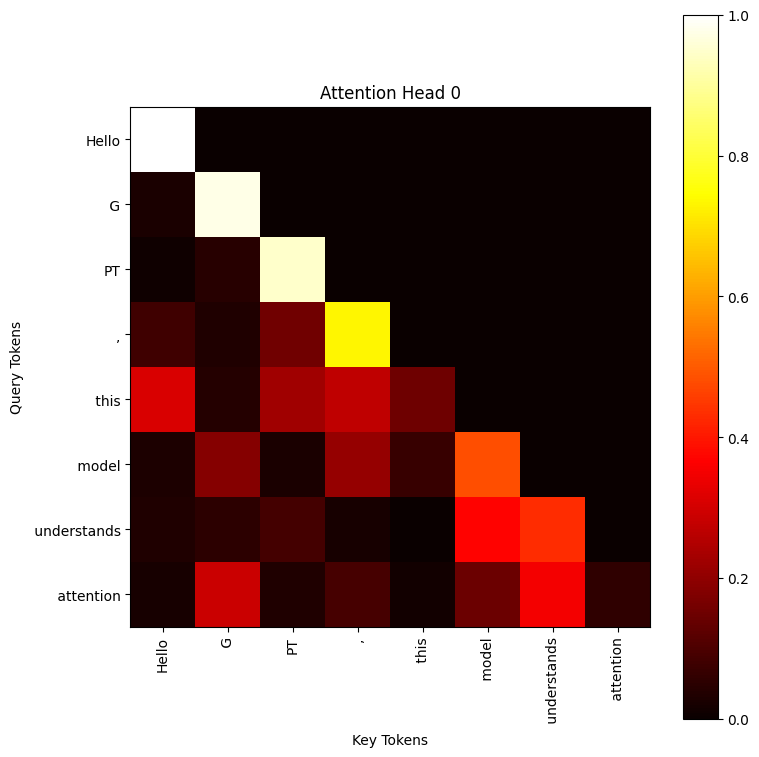
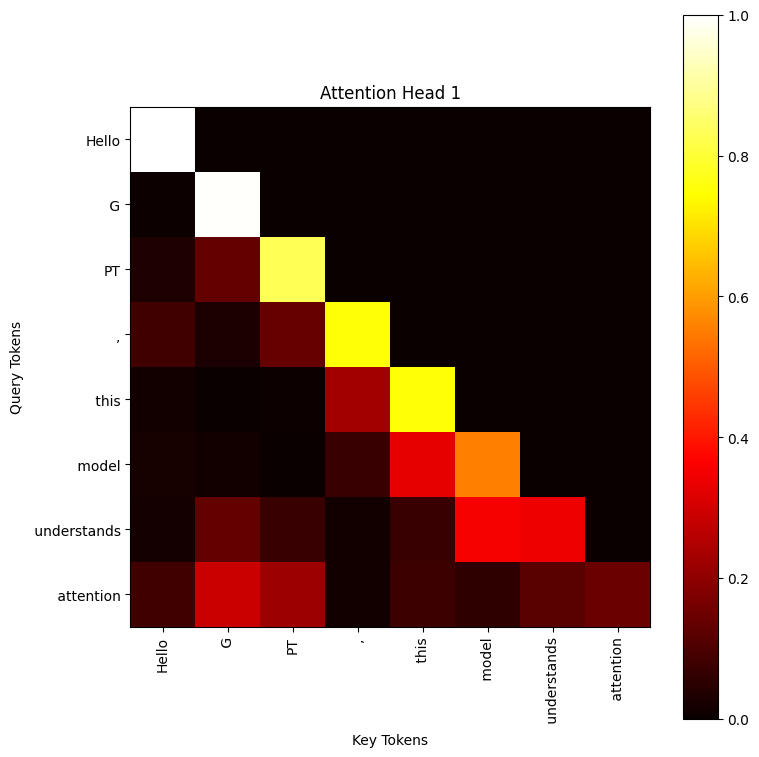
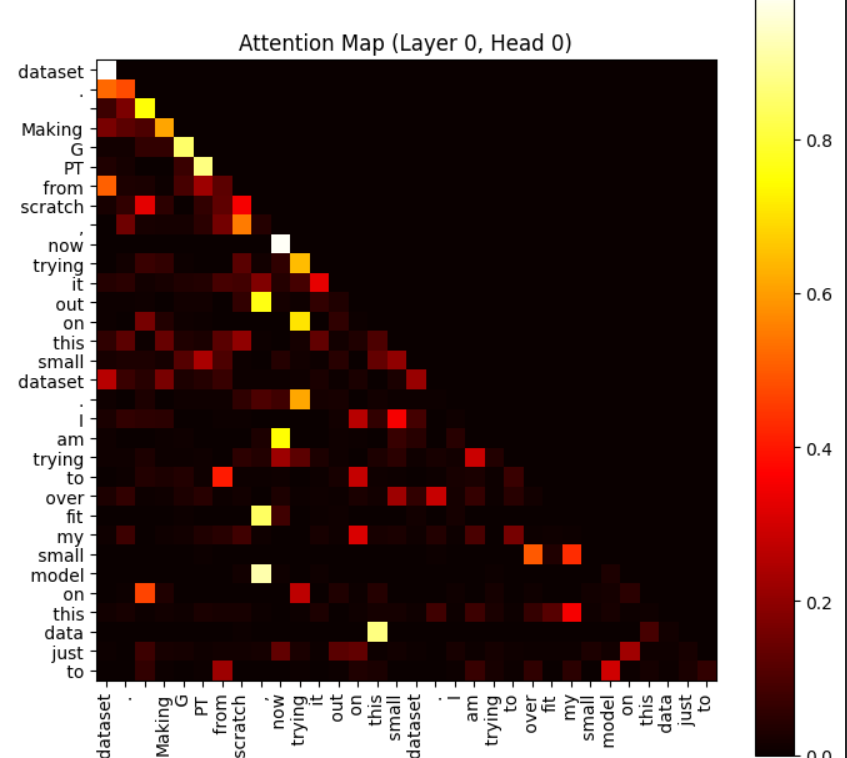

# GPT From Scratch + Attention Visualization

This project implements a **GPT-style decoder-only transformer from scratch using PyTorch**, with a focus on understanding and visualizing how attention works internally.

---

## 🚀 Highlights

* Implemented **multi-head self-attention** from scratch
* Used **causal masking** to enforce autoregressive behavior
* Applied **dropout** for regularization
* Used **GELU activation** instead of ReLU for better generalization
* Verified model correctness via **tiny dataset overfitting**
* Built an **attention visualization tool** to inspect model behavior

---

## 📂 Project Structure

* `gpt_from_scratch.ipynb`
  → Contains the **full implementation of GPT from scratch**, including training pipeline
  → Training was intentionally minimal, only to verify that the model works (loss ~11 → ~0.5)

* `visualize_attention.py` ⭐
  → Main highlight of the project
  → Extracts and visualizes **attention weights across tokens and heads**
  → Demonstrates how the model learns causal relationships

---

## 🧠 Key Concepts Implemented

* Token + positional embeddings
* Transformer blocks (Attention + FeedForward + LayerNorm)
* Multi-head attention mechanism
* Causal masking (no future token leakage)
* GELU activation for smoother learning
* Residual connections and normalization

---
## 🔍 Attention Visualization

The model’s attention weights were extracted and visualized as heatmaps.
## Attention Visualization For 1st Attention Head

## Attention Visualization For 2st Attention Head

## This is what a bigger heatmap looks like

### Observations:

* Strong **diagonal patterns** → tokens attend to themselves
* **Lower triangular structure** → model attends to past tokens
* **Upper triangle suppressed** → masking working correctly
* Different heads show **different attention behaviors**

---

## 📚 Reference

Inspired by:

* Build a Large Language Model (From Scratch)

Extended with:

* debugging and validation
* attention visualization
* structured experimentation

